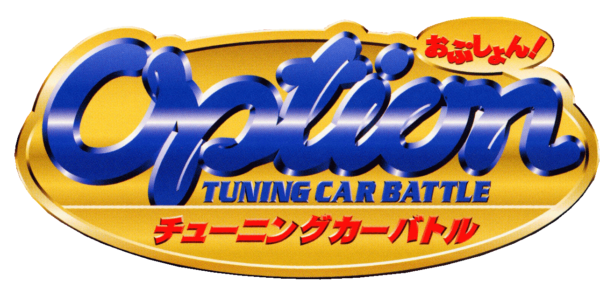
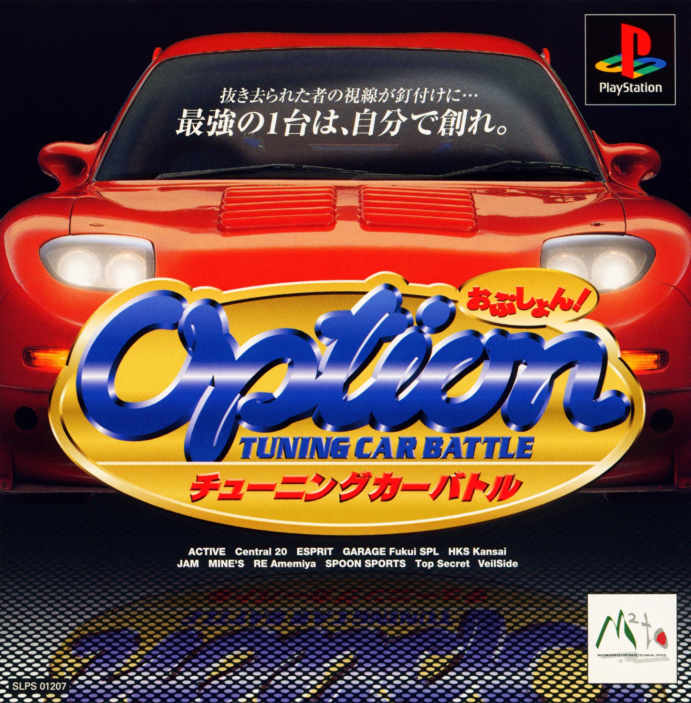
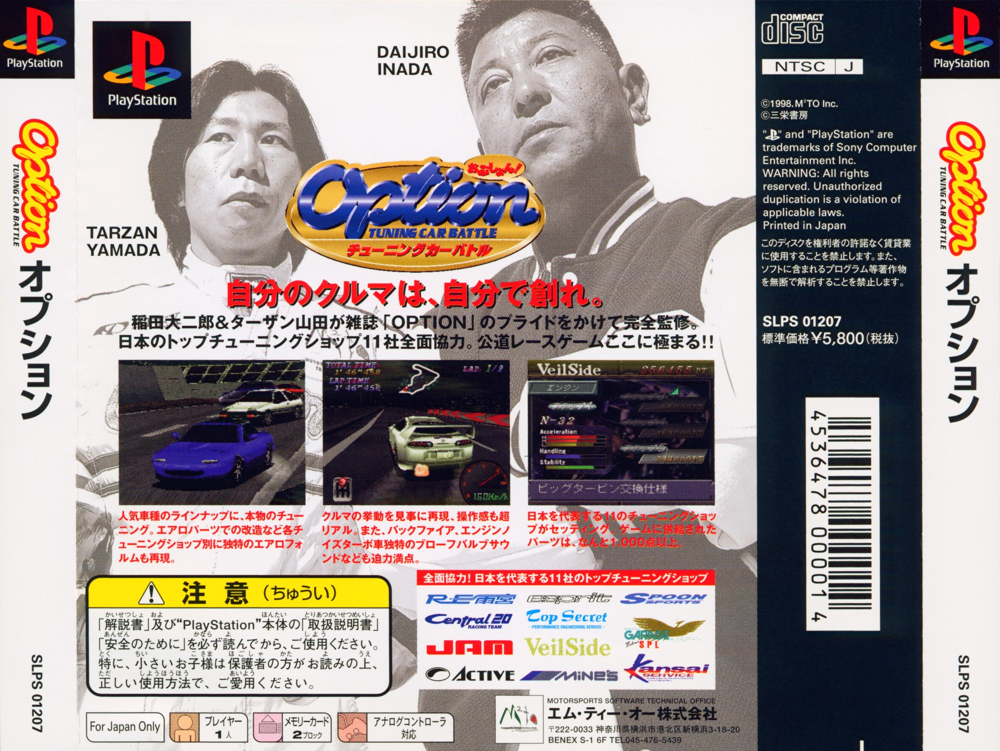
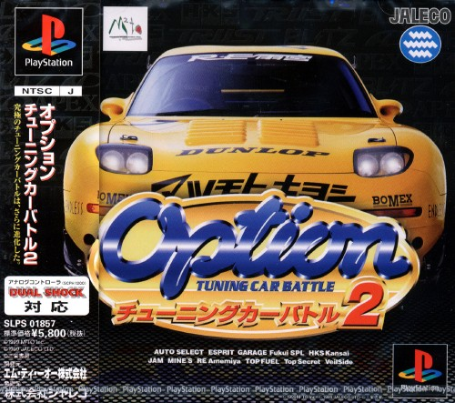
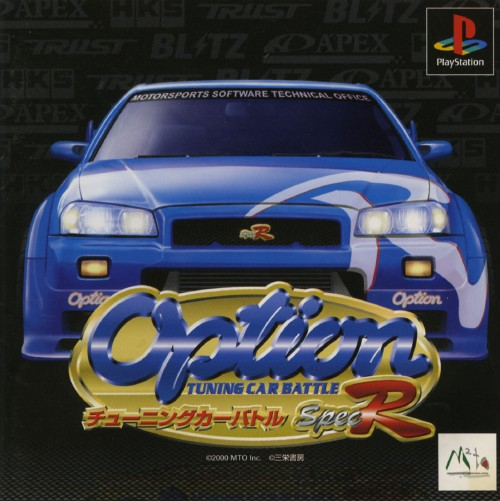
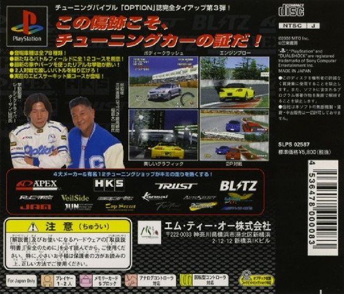

#   Option Tuning Car Battle Modding Tools

Project to potentially create tools for extracting/modifying files in Option Tuning Car Battle Spec R 

Below you will find each game listed with a document detailing each games file structure.

Contributors welcome!

_Discord - https://discord.gg/udzejAFTFb_


_Webpage - https://jeevesgb.github.io/pages/option/option.html_

---

#   Known builds

### Option Tuning Car Battle 1 Demo -   ```SLPM_802.03```

### Option Tuning Car Battle 1      -   ```SLPS_012.07```

### Option Tuning Car Battle 2      -   ```SLPS_018.57```

### Option Tuning Car Battle Spec R -   ```SLPS-025.87```

---

#   OTCB 1 Demo Info    ```SLPM_802.03```

[OTCB Demo Info](docs/otcbdmo.md)
---

#   OTCB 1 Info         ```SLPS_012.07```

[OTCB 1 Info](docs/otcb1.md)

####    Box Art






---

#   OTCB 2 Info         ```SLPS_018.57```

[OTCB 2 Info](docs/otcb2.md)

####    Box Art




---

#   OTCB Spec R Info    ```SLPS-025.87```

[Spec R Info](docs/specr.md)

####    Box Art





######  JejCo 2026